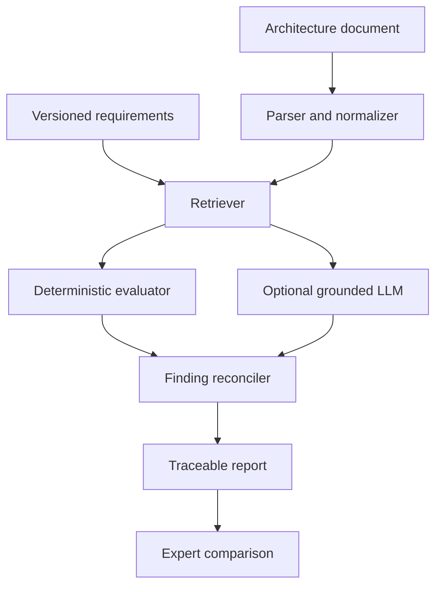

# ArchGuardAI

AI-assisted software and security architecture verification prototype, aligned with Ericsson Master's Thesis Req. 791042.

ArchGuardAI evaluates architecture descriptions against a versioned requirement catalogue, produces traceable findings, explains risks, recommends improvements, and compares system output with expert-reviewed reference assessments.

> The included requirements are **synthetic public examples**, not Ericsson Mandatory Architecture Requirements. Authorized MAR content can be imported only in an approved environment with appropriate access controls.

## Core behavior

- Ingests Markdown, text, JSON and Mermaid architecture descriptions
- Retrieves relevant requirements with TF-IDF
- Runs deterministic evidence and contradiction rules
- Optionally calls a local Ollama model for grounded analysis
- Returns one of four statuses per requirement:
  - `COMPLIANT`: explicit evidence satisfies the criterion
  - `NON_COMPLIANT`: explicit evidence conflicts with the criterion
  - `NOT_ENOUGH_INFORMATION`: required evidence is absent and no contradiction is present
  - `NOT_APPLICABLE`: the requirement is outside the declared scope
- Includes requirement ID, quoted evidence, reasoning, risk, recommendation, confidence, and review flag
- Evaluates precision, recall, false-positive rate, Cohen's kappa, agreement, explanation coverage, and estimated review effort
- Exports JSON and CSV audit artifacts

## Why the evidence policy matters

Missing documentation is recorded as `NOT_ENOUGH_INFORMATION`; it is not automatically treated as proof that the implementation violates a requirement. `NON_COMPLIANT` is reserved for explicit contradictions. This prevents the tool from silently converting documentary gaps into unsupported security claims.

## Architecture



## Quick start

```bash
python -m venv .venv
# Windows: .venv\Scripts\activate
# macOS/Linux: source .venv/bin/activate
pip install -r requirements.txt
pytest -q
streamlit run app.py
```

Run from the command line:

```bash
python scripts/assess.py \
  --document examples/sample_architecture.md \
  --requirements requirements/synthetic_mars.yaml \
  --output reports/sample_assessment.json
```

Evaluate against expert labels:

```bash
python scripts/evaluate.py \
  --predictions reports/sample_assessment.json \
  --reference examples/expert_reference.json
```

## Optional local LLM

The default system works offline and deterministically. To enable local grounded generation:

```bash
ollama pull llama3.2
export ARCHGUARD_OLLAMA_URL=http://localhost:11434
export ARCHGUARD_OLLAMA_MODEL=llama3.2
```

The model receives only the selected requirement and relevant document excerpts. Its output is schema-validated, and deterministic contradictions cannot be overridden by the model.

## Security and responsible-use controls

- No architecture document is transmitted externally by default
- Prompt text treats uploaded documentation as untrusted data
- Input-size limits reduce denial-of-service risk
- Requirement and finding schemas are validated
- Evidence excerpts must be present in the original document
- LLM outputs are suggestions requiring human review
- The tool must not become an automatic approval gate
- Sensitive architecture documents should not be stored in source control
- Production deployments need authentication, authorization, encryption, retention controls, logging, and threat modelling

## Research evaluation design

Use multiple systems, reviewers, document qualities, and requirement categories. Split scenarios before prompt/rule tuning. Report per-class metrics, confusion matrices, reviewer agreement, confidence calibration, explanation quality, review time, and failure cases. Preserve negative results.

## Repository structure

```text
ArchGuardAI/
├── archguard/                 Core package
├── requirements/              Synthetic requirement catalogue
├── examples/                  Example architecture and expert labels
├── scripts/                   CLI tools
├── tests/                     Automated tests
├── app.py                     Streamlit dashboard
├── Dockerfile
└── README.md
```

## License

MIT. See `LICENSE`.
