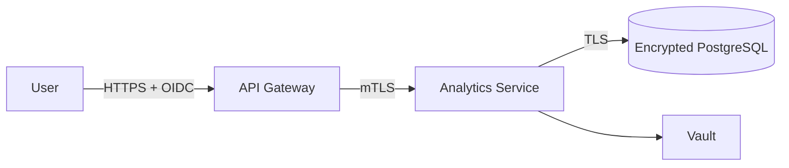

# Equipment Health Platform

Users access the web application through an HTTPS ingress. The API gateway validates OIDC tokens and forwards the authenticated identity to internal services. Authorization uses RBAC with deny-by-default policies.

Services communicate using mutual TLS and have individual workload identities. PostgreSQL data and backups use AES-256 encryption at rest. Credentials are retrieved from a managed Vault instance and rotated every 30 days.

Authentication, authorization, administration, and record-access events are written to a structured, append-only audit log. Services have independent horizontal scaling. Outbound calls use timeouts, bounded retries, and circuit breakers.

The platform processes equipment telemetry but does not describe data-retention periods or deletion procedures.

